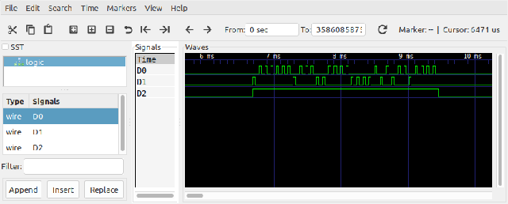
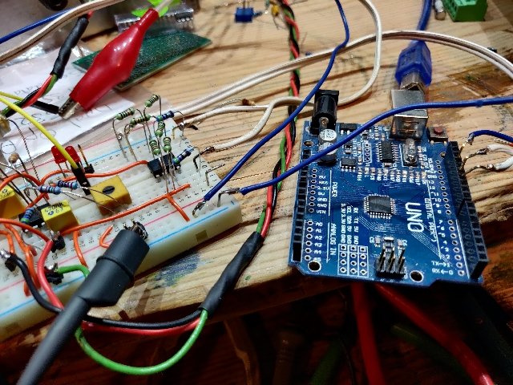
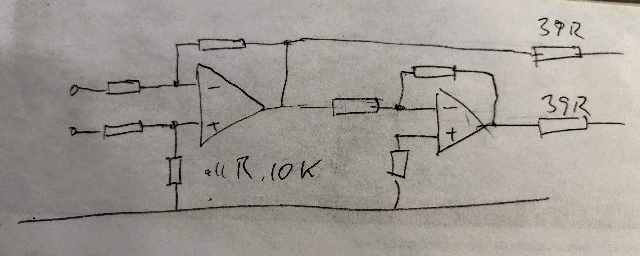
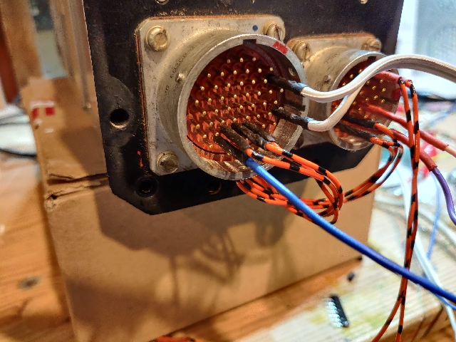
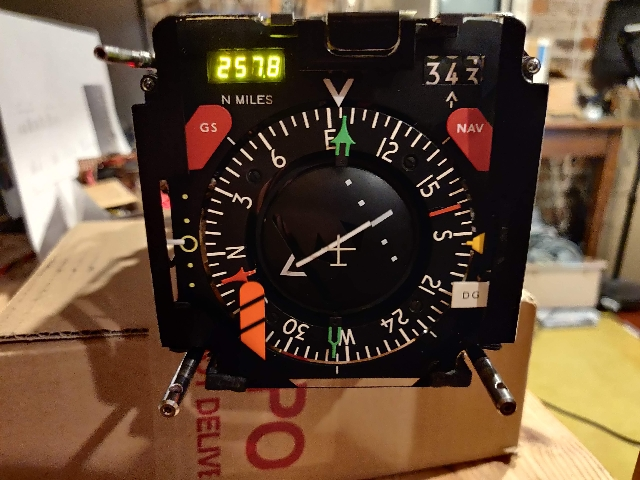

# Aviation-ARINC-encoder

## software

Experimental Arduino sketch to encode display data for display on HSI unit.
Initial version untested waiting for suitable ARINC driver hardware.

Initial work completed using Wokwi virtual arduino nano with output to loogic analyzer file.

[Arduino sketch](ARINC_encoder/ARINC_encoder.ino)

[development wokwi project](https://wokwi.com/arduino/projects/323239666748752467)

The initial software is configured to encode the following data:

```
  label = 0201;  // octal
  sdi   = 0;
  data  = 25786; // decimal
  ssm   = 0;
```


## run result

the program prints the encoded data and a representation of the bitstream output to the GPIO pins.

```
djrm ARINC encoder

parity: 0
ssm: 0
BCD data: 25786
sdi: 0
Label (oct): 201
Bitstream: 0,00,[010,0101,0111,1000,0110],00,10000001
```



## Arduino prototype



## line driver

Proposed circuit of line driver to send data from software above.

[line driver](./images/bal2-f5.gif)

see here for balanced floating line driver: https://sound-au.com/balance.htm

Schematic of prototype: 



## HSI wiring

[HSI Connection document](./Smiths-HSI-pinout.ods)



## HSI LED display


